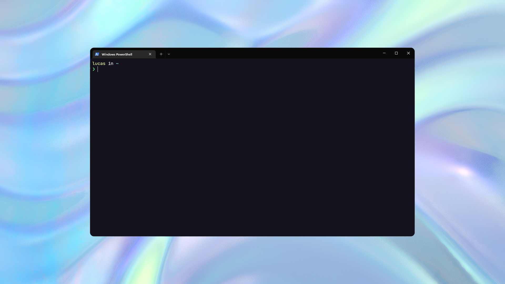

<h1 align="center">
   
  
   
  Omni Owl for <a href="https://www.microsoft.com/pt-br/p/windows-terminal/9n0dx20hk701">Windows Terminal</a>
   
</h1>

  <strong>Dark theme for <a href="https://www.microsoft.com/pt-br/p/windows-terminal/9n0dx20hk701">Windows Terminal</a></strong>

  

  <a href="#install"> Install</a> •
  <a href="#team"> Team</a> •
  <a href="#license"> License</a>

  

## Install

All instructions can be found at [INSTALL.md](./INSTALL.md).

## Team

This theme is maintained by the following person(s) and a bunch of [awesome contributors](https://github.com/upenha/omni-owl-terminal/graphs/contributors).

|  |
| ------------------------------------------------------------------------------------------------ |
| [Upenha](https://github.com/upenha)                                                   |
